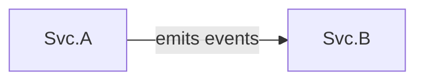

# Service Graph

Rolled-up view of service relationships.

| Service | calls | depends_on | emits_events_to | subscribes_to |
|---------|-------|------------|-----------------|---------------|
| [[Svc.A]] | | | [[Svc.B]] | |
| [[Svc.B]] | | | | |
